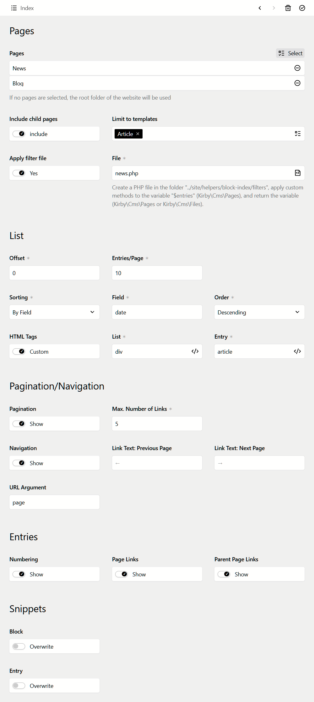

# Kirby Block Index

This plugin displays individual index-pages with a variety of options such as:

* page(s)-selection
  * w/o including children
  * limiting to templates
  * applying custom filters (using $pages-methods)
  * transforming to files is possible with filters
* sorting
  * fields
  * randomizing
* pagination
* navigation
* custom tags
* custom fields
* custom snippets
* extend blueprint with own tabs


Current translations:

- English

- German


<a href="kirby-block-index.png">
    
</a>


## Prerequisites

* Kirby 4.3+


## Installation

### Download

Download and unzip to `/site/plugins`.

### Git submodule

```
git submodule add https://github.com/swiegmann/kirby-block-index.git
```

### Composer

```
composer require swiegmann/kirby-block-index
```


## Usage

Add the block-type `index` to your layout/block-blueprints.
Add a block, select "Index".


## Options

| Property              | Default                           | Description                                                        |
| --------------------- | --------------------------------- | ------------------------------------------------------------------ |
| filterPath            | /site/helpers/block-index/filters | (string) path to custom filter files                               |
| snippetPath           | /site/snippets/block-index        | (string) path to custom snippet files                              |
| paginationUrlArgument | p                                 | (string) url-argument for generated navigation- & pagination-links |

Overwrite all values in `/site/config/config.php`.


## Customize the default view of list and entries

Copy the snippet-files from:

```
/site/plugins/kirby-block-index/snippets/block-index.php
/site/plugins/kirby-block-index/snippets/block-index-entry.php
```

to:

```
/site/snippets/block-index.php
/site/snippets/block-index-entry.php
```

and edit it.


## Add own list/entry fields to the block

Copy the blueprint-files from:

```
/site/plugins/kirby-block-index/blueprints/groups/block-index-custom-list-fields.yml
/site/plugins/kirby-block-index/blueprints/groups/block-index-custom-entry-fields.yml
```

to:

```
/site/blueprints/groups/block-index-custom-list-fields.yml
/site/blueprints/groups/block-index-custom-entry-fields.yml
```

and add your own fields to the blueprints.
The new fields appear below the default list/entry fields.


## Appy filters, sorting, etc. to the results

1. Create a php-file in: `/site/helpers/block-index`.
   *Note: This path is a plugin-option, you can override it.*

2. The file will receive the current result-set of pages with the variable name `$entries`. It is an instance of `Kirby\Cms\Pages`, you can apply all methods of `$pages` to it.
   The file must return the variable, it must end with: `return $entries`.
   *Note: You can return also a variable type of* `Kirby\Cms\Files` *by using the relevant* `$pages`*-methods. So the result can be regular files or images.*

3. In the block-section "Pages" click "Apply filter file" and select the file from the list.


## Customize the default view of list and entries

Copy the snippet-files from:

```
/site/plugins/kirby-block-index/snippets/block-index.php
/site/plugins/kirby-block-index/snippets/block-index-entry.php
```

to:

```
/site/snippets/block-index.php
/site/snippets/block-index-entry.php
```

and edit it.


## Customize the view of a single block instance

Copy the snippet-files from:

```
/site/plugins/kirby-block-index/snippets/block-index.php
/site/plugins/kirby-block-index/snippets/block-index-entry.php
```

to:

```
/site/snippets/block-index/block-index-[your-custom-name].php
/site/snippets/block-index/block-index-entry-[your-custom-name].php
```

*Note: The destination path is a plugin-option, you can override it.*

Edit the files.
In the block-section "Snippet" enable "overwrite" and select the files.